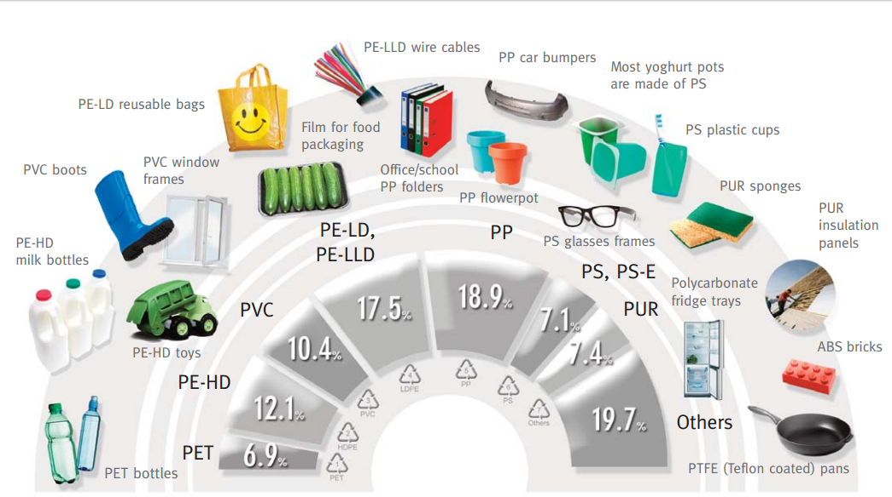
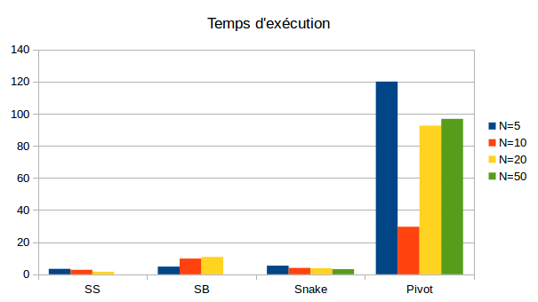
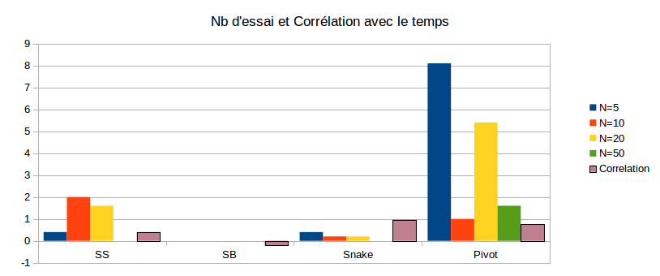
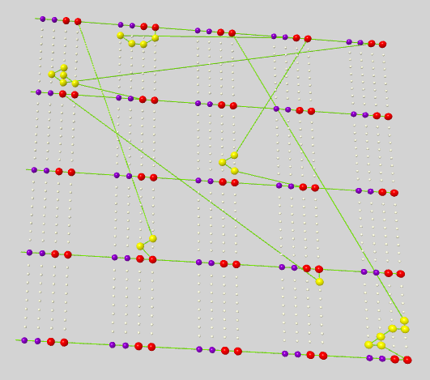
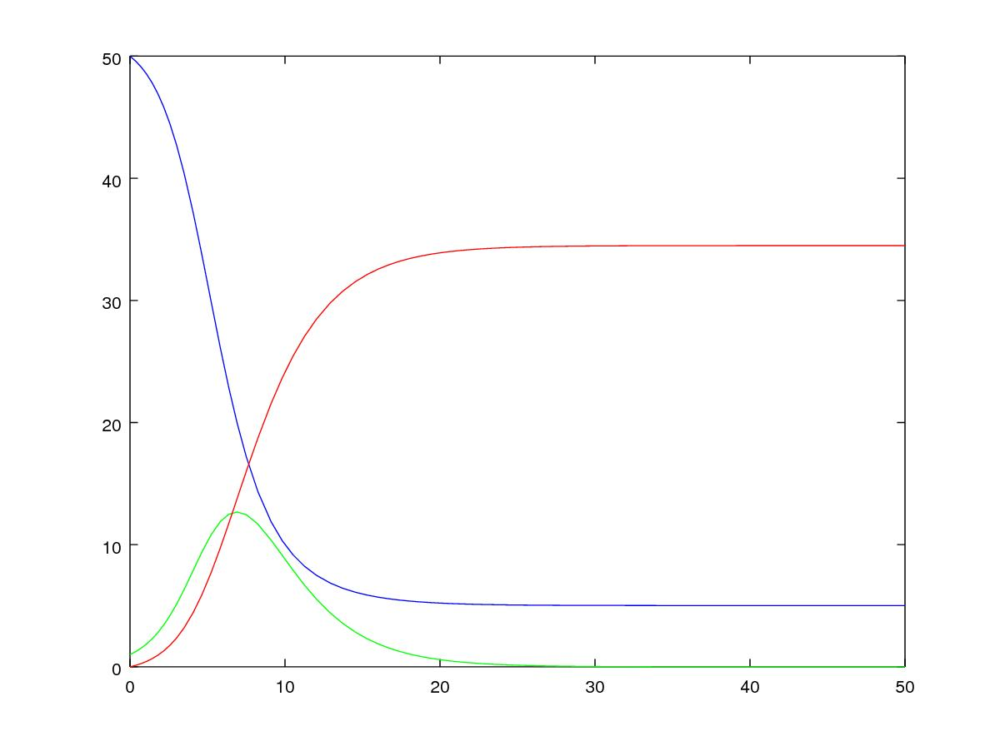
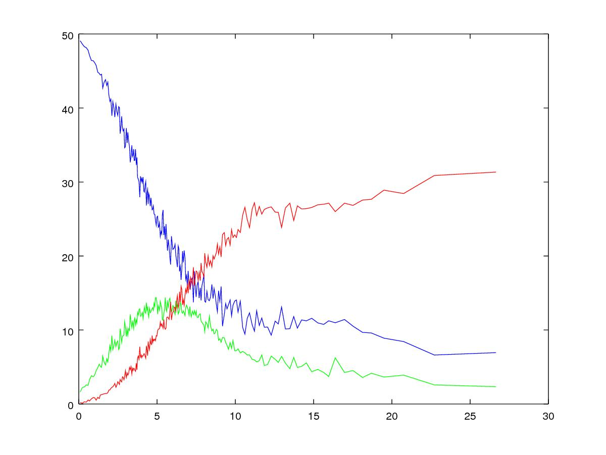
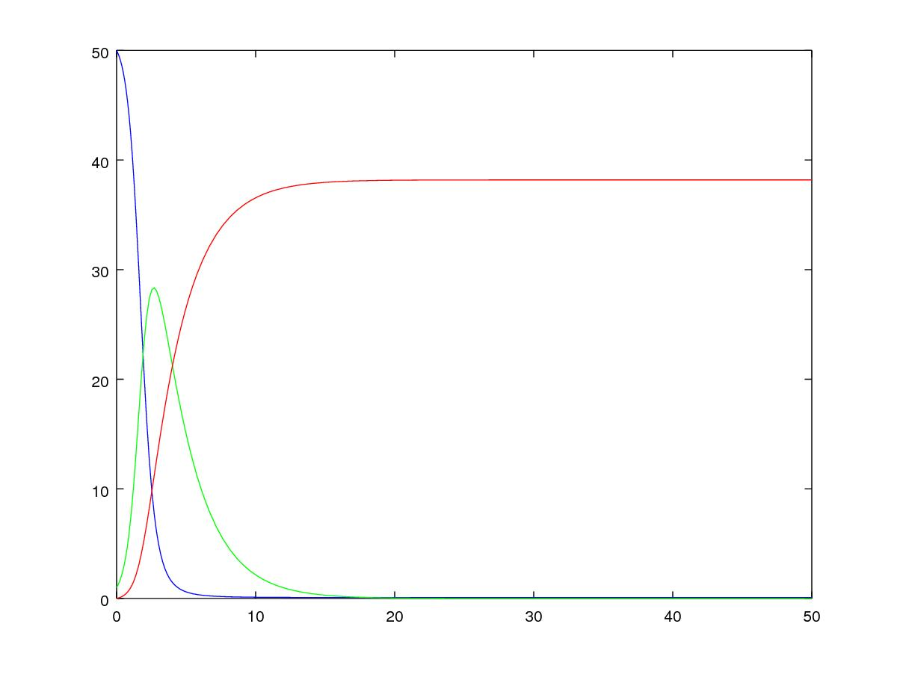
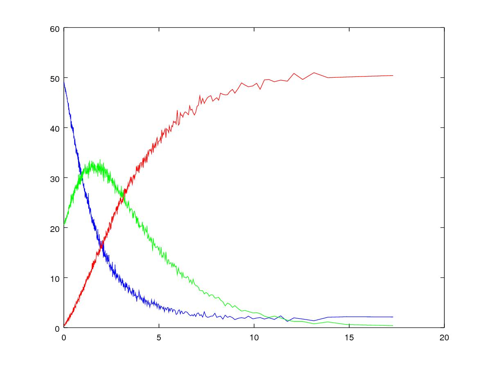
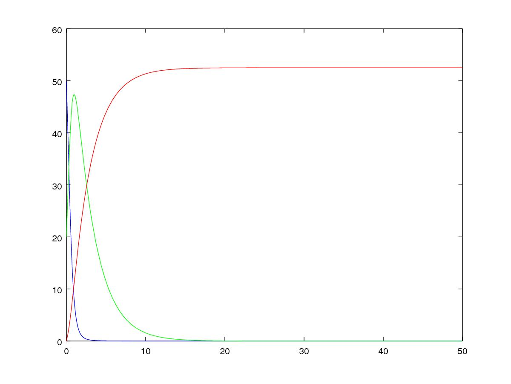

= Applications de marches auto-évitantes et des EDO/EDP dans l'étude des polymères et de l'épidémiologie
Oxana USHAKOVA (Encadrants : V. Vigon, C. Prud'homme)
:feelpp: Feel++
:stem: latexmath
:toc:

== Introduction

Cette recherche concerne l'étude des processus aléatoires et contient deux parties :  marches auto-évitantes (dans le contexte du synthèse des polymères) et EDO stochastiques (dans le contexte de l'épidémiologie).

La science macromoléculaire est étroitement liée avec la chimie, la biochimie, la pharmacologie, etc. Le développement industriel de ces domaines explique la motivation de cette étude. 

Les polymères de synthèse sont devenus l'élément essentiel d'un nombre très important d'objets de la vie courante, dans lesquels ils ont souvent remplacé les substances naturelles. Ils sont présents dans de nombreux domaines industriels:

De point de vue économique l'industrie des polymères est crucial:
 
* 100 $ générés en industrie des polymères donnent 230 $ en PIB 

* 1 emploi généré en industrie des polymères donne 3 emplois dans d'autres domaines.

Les mêmes principes sont utilisés dans la construction des protéines et dans l'épidémiologie, mais pour l'épidémiologie on veut se  concentrer sur l'approche classique, càd le système des ODEs.  On va voir les ODEs déterministes et stochastiques, mais aussi leur dérivation à partir d'un EDP avec le méthode des caractéristiques.

La motivation de l'étude de l'épidémiologie est difficile à sous-estimer. Cette science permet à modéliser de nombreuses maladies, à éffectuer la prévention et/ou controle des epidémies. De plus, on utlise les mêmes idées dans networking, spam, etc.

== **Chapitre 1** : Marches auto-évitantes et les polymères
Un polymère est une marcomolécule constitueé des la répétition des nombreuses monomères à liason covalente. Une chaîne contient typiquement stem:[10^3-10^5] monomères, et a la longeur de stem:[10^{-5} - 10^{-2}] cm. La forme géometrique est aussi importante que les propriétes chimiques.

=== Concept mathématique

On appele une marche auto-évitante (SAW, Self-avoiding walk) une marche des points toutes distincts dans une lattice à dimension stem:[d]. Ce modèle a été créé spécialement pour simuler des polymères linéaires dans un dissolvant il y 50 ans.

Sous la condition que la distance entre les points voisins est constante, on a stem:[2d] pas possibles à chaque étape. Si de plus on suppose, que la marche ne peut pas revenir en arrière, on a stem:[2d-1] pas possible à chaque étape sauf le premier (stem:[2d]).

Voici un exemple d'une marche auto-évitante sur 2D lattice:

 

=== Algorithmes de contruction des SAW

Les algorithmes statiques se basent sur les chaînes de Markov, autrement dit l'itération stem:[n] ne dépend que de stem:[n-1]. 

.Algorithmes Statiques
|===
|Algorithmes|Etapes d'algorithme |Avantages |Disavantages 

|Algorithme de  Simple Sampling

|

* Se mettre à l'origine du polymère

* Générer le premier pas aléatoirement/Choisir le premier pas arbitrairement

* Choisir aléatoirement un des stem:[2d-1] pas

* Si la marche générée s'intersecte, on la rejète et commence dès le début - étape 1

* Si la marche générée nous convient, on rajoute ce pas dans la marche

* Si la marche générée est de longeur souhaitée,on accepte la marche. Sinon, on revient vers étape 3.

* Répéter jusqu'à la marche soit de la longeur souhaitée.

| 
* Facile à programmer

* Pas de bias : toutes configurations sont possibles

|
* Pas efficace pour des chaînes longues dans petites dimensions car la taux du rejet devient trop élévé.

|Algorithme de Biased Sampling

|
* Se mettre à l'origine du polymère

* Générer le premier pas aléatoirement/Choisir le premier pas arbitrairement

* Trouver tous les pas qui ne donne pas l'intersection

* Si il n'y a pas de tels pas - on met le poids stem:[\omega=0], on rejète la marche générée et on revient vers le début - étape 2. Sinon on ajoute ce pas à la marche et recalculont le poids stem:[\omega].

* Si la marche générée est de longeur souhaitée, on accepte la marche et on calcule le poids total. Sinon, on revient vers étape 3.

* Répéter jusqu'à la marche soit de la longeur souhaitée

|
* Pas difficile à programmer

* Beaucoup plus efficace que l'algorithme précedent

* Pas de bias : toutes configurations sont possibles

|
* Pas efficace pour des chaînes trop longues dans petites dimensions car la taux du rejet devient trop élévé
|===

Les algorithmes dynamiques se basent sur SAW, autrement dit l'itération stem:[n] ne dépend pas de stem:[\sum_0^{n-1}]. 

.Algorithmes Dynamiques
|===
|Algorithmes|Etapes d'algorithme |Avantages |Disavantages 

|Algorithme de Reptation

|

* Générer ou chisir un SAW à n pas

* Choisir une fin aléatoirement et la retirer

* Choisir aléatoirement un des stem:[2d-1] pas possibles de l'autre côté

* Si ce pas donne l'intersection, on revient à l'arrière et considère  cette configuration comme nouvelle

* Si ce pas ne donne pas de l'intersection,   on considère cette configuration comme nouvelle

* On revient à l'étape 2 jusqu'à on a la longeur  souhaitée de la marche

| 
* Très efficace

* Chaque itération ne demande que un peu de calcul

|
* Pas intuitive

* Le résultat dépend de l'origine, de la condition initiale

* Bias : il y a des configuration qu'on ne peut jamais obtenir

|Algorithme de Pivot

|
* Générer ou chisir un SAW à n pas

* Choisir aléatoirement un pivot sur la marche. Ce pivot divise la marche en deux

* Choisir aléatoirement une des deux sous-marches

* Choisir aléatoirement un opération symétrique et l'appliquer à la sous-marche

* Si cette opération donne l'intersection, on revient à l'arrière et considère  cette configuration comme nouvelle

* Si cette opération ne donne pas de l'intersection,   on considère cette configuration comme nouvelle

* On revient à l'étape 2 jusqu'à on a la longeur  souhaitée de la marche

|
* Converge vite

* Pas de bias : toutes configurations sont possibles 

|
* Chaque itération demande beaucoup de calcul

* Difficile à implémenter à l'ordinateur : nombres des symétries augmentent très vite

* Pas trop efficace pour des chaînes longues, mais converge toujours aussi vite 
|===

La simulation des algorithmes statiques est assez intuitive et ne nécessite pas de l'explication graphiques, donc on affiche à la fois les deux chaînes générées:

image::ss.png[]

Par contre, pour les algorithmes dynamiques on a fait deux fenêtres : la chaîne initiale et la chaîne générée:

Algorithme de Reptation

image::snake.png[]

Algorithme de Pivot

image::pivot.png[]

==== Comparaisons des algorithmes

Les résultats réçus ne sont pas étonnants: on peut observer l'augmentation du temps d'exécution pour les algorithmes statiques en fonction de N. L'algorithme de Reptation est assez stable, par contre l'algorothme de pivot ne semble pas trop éfficace par rapport aux autres. 

Le nombre d'essai avant succèss est un autre moyen de voir l'efficacité. Ici de nouveau les méthodes statiques, surtout le méthode simple, demande de plus en plus tentatives pour construire la chaine nécessaire.  **L'algorithmede Reptation** reste toujours le plus optimal. De plus, le coefficient de corrélation entre temps d'exécution et nb d'essais avant succès pour cet algorithme est presque égal à 1, ce qui est important pour la gestion de grands projets (à l'étape de planification). Il faut quand même tenir compte que les méthodes dynamiques ont besoin de la marche auto-évitante initiale, contruite évidemment par un des méthodes statiques.  

=== Autre application : Vulcanisation 

Vulcanisation est un procédé chimique consistant à incorporer un agent vulcanisant (soufre) à un polymère pour former des ponts entre les chaînes molèculaires après la cuisson. Cette opération est largement utiliser dans le domaine de la production des pneu, car le polymère vulcanisé devient plus élastique et solide, moins plastique et moins dissoluble en dissolvants organiques.

Considèrons un 2-méthylbuta-1,3-diène polymérisé, autrement dit le caoutchouc naturel. Si on rajoute du soufre, après cuisson, on obtient un nouveau matériau qu'on utilise quotidiennement aujourd'hui. A l'echelle moléculaire on voit un réseau des monomères liés entre eux directement (comme le polymère d'avant) et par les molécules d'agent vulcanisant.

Voici un exemple avec le caoutchouc synthétique buta-1,3-diène polymérisé. 

image::m1.png[]

On rajoute du soufre et après "la cuisson" on obtient le réseau des monomères liés entre eux en polymères et liés aux monomères des macromolécules voisines par les ponts du soufre. La longeur du pont, càd le nombre des atomes du soufre, varie aléatoirement de 1 à 8:

|====
image:m2.png[] | image:vulca2D.png[]
|==== 

Le soufre n'affect pas tous les monomères d'une molécule, même pas tous les molécules - les doubles liens affectés sont choisi aléatoirement. Mais en augmentant la concentration du soufre à 30% on se retrouve dans le cas où tous les doubles liens sont pris par soufre et la longeur des pont n'excède 2 atomes : le matériau résultant est l'ébonite. La longeurs réduite des ponts s'explique par les condition de cuisson : aux temperatures exrtrêmes ( stem:[> 800°] ) le nombre des atomes dans une molécule de soufre diminue de 8 à 1-2. 

Pour simuler la vulcanisation en Mathis on utilise le méthode statique "Biased Sampling". On peut changer la taille du "réseau" et le nombre des molécules du soufre : 

=== Autre application : Modèle SI

Comme l'introduction au chapitre 2 on va considéré un exemple le plus simple de l'épidémiologie -  le modèle SI : susceptible, infected - est un modèle très simple, qui permet de modèliser la propagation de la varicelle et d'autres maladies qui peuvent être coupées par vaccination. 

image::SIscheme.png[]
image::SIdyn.png[]

On a fait une simulation du modèle SI en mathis. On a utilisé les marches auto-évitantes sur un arbre, générées par l'algorithme statique "Biased Sampling". 

video::SI.mp4[]

== **Chapitre 2** : EDO/EDP et l'épidémiologie

Les modèles mathématiques de maladies infectieuses ont commencé à être mis en pratique avec le problème du SIDA dans les années 1980. Ces modèles se basent sur le même rincipe :  on divise la population en classes épidémiologiques tels que les individus susceptibles d'être infectés, ceux qui sont infectieux, et ceux qui ont acquis une immunité à la suite de la guérison. Cette approche est utilisée non seulement   pour modéliser de très nombreuses maladies, mais aussi dans l'étude de la science des réseaux.

=== Modèle SIR 

L'objet principal de cette étude est le modèle SIR : susceptible, infected, recovered - un autre modèle assez  simple, à partir duquel on dérive des modèles plus complexes. SIR permet de modèliser la propagation de la rougele ou parotidite virale. De plus, on supose le cas sans dynamique vitale, c.à.d personne n'est ni née, ni décédée (cause naturelle).

image::SIRdynamique.png[]

==== ODEs Déterministes

Le modèle SIR est décrit par le système des ODEs suivant:

Problème initial:

* stem:[\frac{dS}{dt}= - \alpha IS] 
* stem:[\frac{dI}{dt}= \alpha IS -(\gamma + \beta) I]
* stem:[\frac{dR}{dt}= \beta I ] 

avec stem:[\alpha] - taux d'infection, stem:[\beta] - taux de rétablissement, stem:[\gamma] - taux de mortalité, induite par l'infection.

==== ODEs Stochastiques

On fait le choix aléatoire entre S,I,R:

* Si on choisi S, donc on le change pour I avec la probabilité stem:[ \frac{\alpha NI(t)}{N-1}]
* Si on choisi I, donc on le change pour R avec la probabilité stem:[\beta]
* Si on choisi R, donc on le change pour S avec la probabilité stem:[\gamma]

Sous les hypothèses:

* stem:[A(\Delta t) \approx A_0 \Delta t]
* stem:[B(\Delta t) \approx B_0 \Delta t]
* stem:[C(\Delta t) \approx C_0 \Delta t]

On obtient la discretization Euler du problème initial:

* stem:[S(t+\Delta t)=S(t)(1-A(\Delta t)I(t))+R(t)C(\Delta t)]
* stem:[I(t+\Delta t)=I(t)(1-B(\Delta t))+A(\Delta t) I(t) S(t)]
* stem:[R(t+\Delta t)=R(t)(1-C(\Delta t))+B(\Delta t)I(t)]

==== Résultats

1 personne infectée sur 50 avec taux de mortalité induite par l'infection stem:[\gamma = 0.1] et taux de rétablissement stem:[\beta = 0.3]

taux d'infection stem:[\alpha = 0.2] 

|====
 | 
|====

taux d'infection stem:[\alpha = 0.5]

|====
 | image:s1_05.jpg[]
|====

taux d'infection stem:[\alpha = 0.8]

|====
image:d1_08.jpg[] | image:s1_08.jpg[]
|====

20 personne infectée sur 50 avec taux de mortalité induite par l'infection stem:[\gamma = 0.1] et taux de rétablissement stem:[\beta = 0.3]

taux d'infection stem:[\alpha = 0.2]

|====
image:d20_02.jpg[] | 
|====

taux d'infection stem:[\alpha = 0.5]

|====
 | image:s20_05.jpg[]
|====

taux d'infection stem:[\alpha = 0.8]

|====
image:d20_08.jpg[] | image:s20_08.jpg[]
|====

=== Modèle SIR déterministe comme une EDP

Le modèle SIR peut considéré comme une EDP hyperbolique de Kolmogorov, qui peut être résolue par le méthode des caractéristiques

==== La méthode des caractéristiques

La méthode des caractéristiques est une technique permettant de résoudre les équations aux dérivées partielles. Particulièrement adaptée aux problèmes de transport, elle est utilisée dans de nombreux domaines tels que la mécanique des fluides ou le transport de particules. 

Pour une équation aux dérivées partielles du premier ordre, la méthode des caractéristiques cherche des courbes  « caractéristiques » le long desquelles l'équation aux dérivées partielles se réduit à une simple équation différentielle ordinaire. La résolution de l'équation différentielle ordinaire le long d'une caractéristique permet de retrouver la solution du problème original.

==== Dérivation de EDP hyperbolique de Kolmogorov

Supposons stem:[P_{N, \Delta t} (t,n,m)] - la probabilité au moment stem:[t] d'avoir stem:[n] personnes susceptibles, stem:[m] personnes infectées et stem:[N-n-m] personnes immunisées dans population constante stem:[N].

Les constantes stem:[\alpha, \beta, \gamma] au limite 

stem:[P_{N, \Delta t} (t+\Delta t,n,m) = \alpha \frac{(n+1)(m-1)}{N(N-1)} P_{N, \Delta t}(t,n+1,m-1)] 
stem:[ + \beta \frac{m+1}{N} P_{N, \Delta t} (t,n,m+1) + \gamma \frac{N-n-m+1}{N}P_{N, \Delta t}(t,n-1,m) ] 
stem:[ + (\frac{n}{N} (1-\alpha \frac{m}{N-1}) +\frac{m}{N}(1-\beta) + \frac {N-n-m}{N}(1-\gamma)  ) P_{N, \Delta t}(t,n,m)]

Maintenant, on pose stem:[x=n/N], stem:[y=m/N] et stem:[p(t,x,y)=NP_{N, \Delta t}(t,xN,yN)].

stem:[t+\Delta t,x,y)= \alpha \frac{(x+1/N)(y-1/N)}{1-1/N} p(t,x+1/N,y-1/N)]
stem:[+ \beta (y+\frac{1}{N}) p(t,x,y+1/N) + \gamma (1-x-y+\frac{1}{N}) p(t,x-1/N,y)] 
stem:[ + (x(1-\frac{\alpha y}{1-1/N}) +y(1-\beta)+(1-x-y)(1-\gamma)  p(t,x,y)]
stem:[ \approx p+\frac{1}{N} (\partial_x ((\alpha xy - \gamma(1-x-y))p) +\partial_y((\beta-\alpha x)yp) ]

Enfin, on obtient l'EDP hyperbolique de Kolmogorov: 

stem:[\partial_t p = \partial_x ((axy-c(1-x-y))p)+\partial_y ((b-ax)yp) ] 

avec la probabilité stem:[ \frac{d}{dt} \int_S p(t,x,y)dxdy=0] où S est l'ensemble du maillage.

Dans le cas où on suppose qu'on sait la proportion exacte de stem:[S,I] et stem:[ R] au moment stem:[t], donc on peut trouver la solution pour tout stem:[t].  Dans notre cas, on ne sait que la loi de  = probabilité, donc l'équation de Kolmogorov transport cette probabilité dans le temps.

Soit **x** = (x,y) , stem:[\Phi_t(\textbf{x})] - est la carte des flux pour le modèle SIR :

* stem:[X = c(1-X-Y)- \alpha XY]
* stem:[Y = (aX-b)Y]

Let stem:[p_0(\textbf{x}) \in C^1 (R^2)] et stem:[Q] satisfait:

stem:[ F * \nabla Q = - \nabla * F ] (F is rhs).

On réecrit :

stem:[p(t,x,y) = e^{Q(\textbf x)-Q(\Phi_{-t}(\textbf{x}))}p_0(\Phi_{-t}(\textbf{x}))] avec stem:[\textbf{x}=(x,y)].

Donc au final avec stem:[{x}_0 \in] S, càd  stem:[{x}_0] - élément du maillage:

stem:[e^{-Q(\phi_t( \textbf{x}_0))}p(t,\phi_t(\textbf{x}_0)) =e^{Q(\textbf{x}_0)} p_0(\textbf{x}_0) ]

Par conséquent:

stem:[0=e^{Q(\phi_t (x_0))} \frac{d}{dt} e^{-Q(\phi_t(\textbf{x}_0))}p(t,\phi_t(\textbf{x}_0))= ]

stem:[=-F(\phi_t(\textbf{x}_0))*\nabla Q (\phi_t(\textbf{x}_0))p(t,\phi_t(\textbf{x}_0))+\partial_t p(t,\phi_t (\textbf{x}_0))+F(\phi_t(\textbf{x}_0)) \nabla p(t,\phi_t(\textbf{x}_0))] 

stem:[=\nabla * Fp+ F\nabla p+ \partial_t p]

stem:[=\partial_t p + \nabla *(pF)]

D'où vient, que les equations du modèle SIR  forment les caractéristiques pour l'EDP hyperbolique de Kolmogorov et la densité de la probabilité sera transporté le long de ces caractéristiques.

=== Améliorations possibles

Pour l'étude plus détailée de l'épidémiologie on propose l'équation de Fokker-Planck - une équation aux dérivées partielles linéaire que doit satisfaire la densité de probabilité de transition d'un processus de Markov. Cette équation a permit à étudier le mouvement brownien d'une particule dans un champ de forces. Vue la nature stochastique de cet EDP, sa solution avec MEF nécessite de l'adaptation du maillage à chaque pas. FreeFem++ permet le faire assez simple: 

video::adaptMesh.mp4[]

== Conclusion

**Partie 1**: Les méthodes statiques sont très facile à implémenter et ils sont nécessaires pour créer des marches pour les méthodes dynamiques. Par contre, pour des simulations réelles l'efficacité de ces méthodes est limité par le nombre des monomères dans une chaîne.
En revanche, les méthodes dynamiques ne sont pas si intuitives mais leur complexité est compensée par la diversité des chaines qu'ils peuvent créer.  

**Partie 2**: Les EDOs stochastiques sont largement utilisées dans L'épidémiologie. On a vue 2 approches : solution du système des EDOs avec Octave et dérviation des EDOs à partir l'EDP hyperbolique de Kolmogorov par le méthode des caractéristiques, qui peut être vu comme une alternative à MEF pour les EDPs de transport (y compris stochastiques). 

== Project Management

=== Diagramme de Gantt

image::gantt.png[]

=== GitHub

- https://github.com/vincentvigon/MATHIS2/tree/polymers ( y compris TODO liste, mise à jour chaque semaine)
- https://github.com/feelpp/2017-stage-oxana (y compris "Project")

== Bibliographie

- Sokal, D.A. "Monte Carlo methods for the self-avoiding walk". New York University, Department of Physics, May 1994;

- Beleno, C., Yau, K. "Polymers". Universitãt Bonn, Computational Physics Project, WS 10/11;

- Isham, V. "Stochastic Models for Epidemics". University College London, Department of Statistical Science, December 2004;

- Chalub, F., Souza, M. "The SIR epidemic model from a PDE point of view". Mathematical and Computer Modelling, Volume 53, Issues 7–8, April 2011, Pages 1568-1574;

